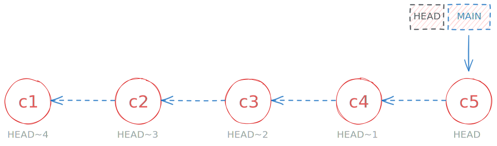
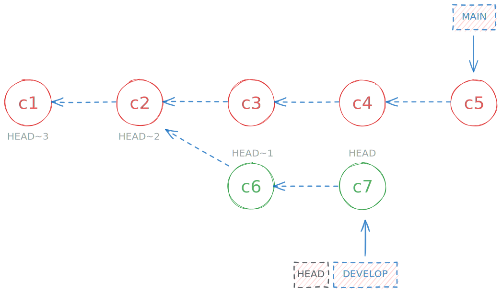
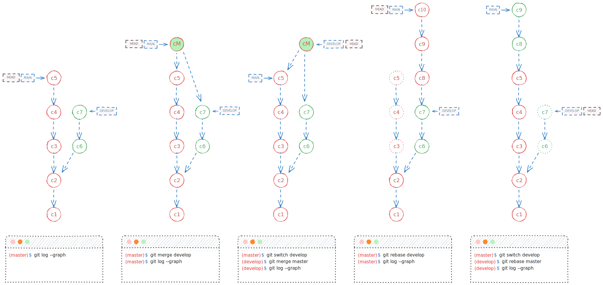

# GIT-Course

<code>Fundamentos de GIT</code>

Creado por <code>GncDev</code> para explicar fundamentos de <code>Sistemas operativos</code>.

## Comandos Git
Confirmar los cambios requiere agregar un mensaje corto y explicito que describa los cambios realizados al grupo de trabajo.

## Agenda
1. [Comandos básicos](#1-comandos-básicos).
1. [Identificar commits](#2-identificar-commits).
1. [Gestión de ramas](#3-gestión-de-ramas).
1. [Corrección avanzada](#4-corrección-avanzada).

 

---
## 1. [Comandos básicos](#agenda)

### 1.1. Para iniciar configurar y visualizar ✔
|Función|Ejemplos de comandos|
|:--|:--|
|Iniciar un nuevo repositorio local|`git init`|
|Clonar un repositorio remoto en local|`git clone git@github.com:GiancarloBenavides/Git-Course.git`|
|Configurar un repositorio local|`git config user.email gncdev@empresa.com`|
|Visualizar configuraciones|`git config --list` `git config user.name`|
|Visualizar remotos configurados|`git remote -v`|
|Visualizar todas las ramas creadas|`git branch -la`|
|Visualizar los últimos 10 commit, todas las ramas|`git log -n 10 --oneline --graph --all`|

### 1.2. Para enviar cambios a un remoto ✔
|Función|Ejemplos de comandos|
|:--|:--|
|Agregar uno o varios archivos a la zona de estancia|`git add main.py` `git add .`|
|Grabar cambios en el repositorio local|`git commit -m "init: first commit"`|
|Agregar cambios al ultimo commit|`git commit --amend -m "init: first commit"`|
|Enviar cambios a un repositorio remoto|`git push` `git push origin`|

### 1.3. Traer cambios desde un remoto ✔
|Función|Ejemplos de comandos|
|:--|:--|
|Traer cambios de un remoto al directorio de trabajo|`git pull`|
|Traer cambios de un repositorio remoto al local|`git fetch`|
|Unir cambios del local y el directorio de trabajo|`git merge`|

## 2. [Identificar commits](#agenda)

### 2.1. Comandos útiles ✔
|Función|Ejemplos de comandos|
|:--|:--|
|Identificar a quien apunta HEAD|`cat .git/HEAD`|
|Id del commit al que apunta master|`cat .git/refs/heads/master`|
|Id del commit al que apunta HEAD|<code> cat .git/$(cat .git/HEAD &#124; cut -c 6-)</code>|
|Id del 3er commit antes del último|`git show -s --format=%h HEAD~3`|

## 3. [Gestión de ramas](#agenda)

### 3.1. Creación y eliminación de ramas ✔
|Función|Ejemplos de comandos|
|:--|:--|
|Incluye los cambios de una rama en la actual|`git branch "develop"`|
|Crear una rama derivada de HEAD-3|`git branch develop HEAD~3`|
|Crear y/o cambiar a una rama|`git switch -c develop`|
|Eliminar una rama fusionada|`git branch -d develop`|
|Forzar eliminar rama no fusionada|`git branch -D develop`|
|Crear una rama a partir del penúltimo stash|`git stash branch feature-01 stash@{1}`|

### 3.2. Fusionar ramas ✔
|Función|Ejemplos de comandos|
|:--|:--|
|Agregar una rama a la actual manteniendo histórico|`git merge --no-commit develop`|
|Adicionalmente generar un commit "Merge branch"|`git merge develop`|
|Fusionar dos ramas en una|`git rebase develop`|
|Guardar los cambios en un directorio temporal|`git stash -u`|
|Recuperar los cambios del directorio temporal|`git stash pop` `git stash apply`|

#### 3.2.1. Merge vs Rebase

## 4. [Corrección avanzada](#agenda)
|Función|Ejemplos de comandos|
|:--|:--|
|Restaurar archivos del work tree|`git restore`|
|Restaurar archivos del staying area|`git restore`|
|Deshacer los últimos 2 commit|`git reset --soft HEAD~2`|
|Deshacer los cambios en los últimos 2 commit|`git reset --hard HEAD~2`|
||`git revert`|

### 4.1. restaurar cambios ✔

### 4.2. Comparar ✔
|Función|Ejemplos de comandos|
|:--|:--|
|Ver las diferencias en un stash|`git stash show`|
|Ver las diferencias en el árbol de trabajo|`git diff --color-words`|

---
## Mas Recursos
- [Herramienta gráfica](https://git-school.github.io/visualizing-git/) (Git-school)
- [Git Tutorial](https://www.atlassian.com/git/glossary#commands) (Atlassian)
- [GIt Book](https://git-scm.com/book/en/v2) (Git-scm)
- [Reference](https://git-scm.com/docs) (Git-scm)
- [Video-curso](https://www.youtube.com/watch?v=GwkgaANyjjw&list=PLTd5ehIj0goMCnj6V5NdzSIHBgrIXckGU) (YouTube)