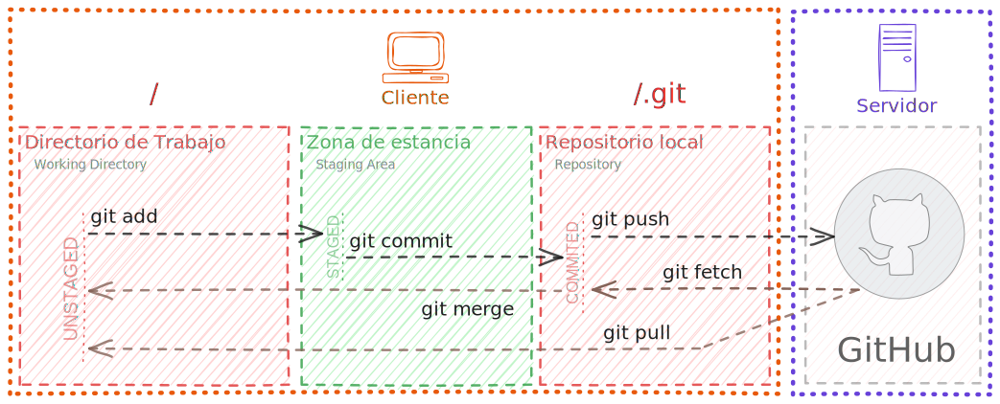
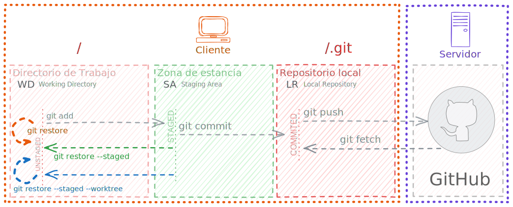

# GIT-Course

<code>Fundamentos de GIT</code>

Creado por <code>GncDev</code> para explicar fundamentos de <code>Sistemas operativos</code>.

## Comandos Git
Confirmar los cambios requiere agregar un mensaje corto y explicito que describa los cambios realizados al grupo de trabajo.

## Agenda
1. [Comandos básicos](#1-comandos-básicos).
1. [Identificar commits](#2-identificar-commits).
1. [Gestión de ramas](#3-gestión-de-ramas).
1. [Corrección avanzada](#4-corrección-avanzada).

 

---
## 1. [Comandos básicos](#agenda)

### 1.1. Para iniciar un repositorio local ✔
|Función|Ejemplos de comandos|
|:--|:--|
|Iniciar un nuevo repositorio local|`git init`|
|Clonar un repositorio remoto en local|`git clone git@github.com:GiancarloBenavides/Git-Course.git`|
|Configurar un repositorio local|`git config user.email gncdev@empresa.com`|
|Visualizar configuraciones|`git config --list` `git config user.name`|
|Visualizar remotos configurados|`git remote -v`|

### 1.2. Para guardar cambios en el repositorio local ✔
|Función|Ejemplos de comandos|
|:--|:--|
|Agregar uno o varios archivos a la zona de estancia|`git add main.py` `git add .`|
|Grabar cambios de la estancia en el repositorio local|`git commit -m "init: first commit"`|
|Grabar cambios de la estancia en el repositorio local|`git commit -am "feat: second commit"`|
|Agregar cambios al ultimo commit en el repositorio local|`git commit --amend -m "feat: second commit"`|
|Visualizar los últimos 10 commit, todas las ramas|`git log -n 10 --oneline --graph --all`|

### 1.3. Intercambiar commits con un repositorio remoto ✔
|Función|Ejemplos de comandos|
|:--|:--|
|Enviar cambios a un repositorio remoto|`git push` `git push origin`|
|Traer cambios de un remoto al directorio de trabajo|`git pull`|
|Traer cambios de un repositorio remoto al local|`git fetch`|
|Unir cambios del local y el directorio de trabajo|`git merge`|

## 2. [Identificar commits](#agenda)

### 2.1. Referencias y comandos útiles ✔
|Función|Ejemplos de comandos|
|:--|:--|
|Identificar a quien apunta HEAD|`cat .git/HEAD`|
|Id del commit al que apunta master|`cat .git/refs/heads/master`|
|Id del commit al que apunta HEAD|<code> cat .git/$(cat .git/HEAD &#124; cut -c 6-)</code>|
|Id del 3er commit antes del último|`git show -s --format=%h HEAD~3`|
|Visualizar las referencias del indice|`git reflog`|

### 2.1. Creación de etiquetas ✔
|Función|Ejemplos de comandos|
|:--|:--|
|Creación de etiquetas anotadas|`git tag -a v1.06-rc1 -m "v:1.06 rc:1 date:2024"`|
|Crear una etiqueta a un commit|`git tag v1.05.247 9864cb2`|
|Cambiar una etiqueta existente|`git tag -f v1.05.248 9864cb2`|
|Eliminar una etiqueta|`git tag -d v1.05.248`|
|Enviar etiquetas a un remoto|`git push origin v1.4`|
|Visualizar todas las etiquetas|`git tag`|
|Visualizar etiquetas release candidate|`git tag -l *-rc*`|

## 3. [Gestión de ramas](#agenda)

### 3.1. Creación y eliminación de ramas ✔
|Función|Ejemplos de comandos|
|:--|:--|
|Incluye los cambios de una rama en la actual|`git branch "develop"`|
|Crear una rama derivada de HEAD-3|`git branch develop HEAD~3`|
|Crear y/o cambiar a una rama|`git switch -c develop`|
|Eliminar una rama fusionada|`git branch -d develop`|
|Forzar eliminar rama no fusionada|`git branch -D develop`|
|Visualizar todas las ramas creadas|`git branch -la`|

### 3.2. Creación y eliminación de reservas ✔
|Función|Ejemplos de comandos|
|:--|:--|
|Guardar cambios no confirmados en una reserva|`git stash`|
|Incluir los cambios en archivos sin seguimiento|`git stash -u`|
|Recuperar los cambios del directorio temporal|`git stash pop` `git stash apply`|
|Crear una rama a partir del penúltimo stash|`git stash branch feature-01 stash@{1}`|

### 3.2. Fusionar ramas ✔
|Función|Ejemplos de comandos|
|:--|:--|
|Agregar otra rama a la actual manteniendo histórico|`git merge --no-commit develop`|
|Adicionalmente generar un commit "Merge branch"|`git merge develop`|
|Agregar cambios de la rama actual a otra|`git rebase develop`|

#### 3.2.1. Merge vs Rebase

## 4. [Modificaciones y auditoria avanzados](#agenda)

### 4.1. Restaurar o eliminar cambios ✔
|Función|Ejemplos de comandos|
|:--|:--|
|🛑Restaurar un archivo hasta el ultimo commit|`git restore main.py`|
|🛑Restaurar archivo incluyendo staying area|`git restore -SW main.py`|
|⚠️Deshacer los últimos 2 commit|`git reset --soft HEAD~2`|
|🛑Deshacer los cambios en los últimos 2 commit|`git reset --hard HEAD~2`|
|⚠️Recuperar el estado a un commit del historial|`git revert e902310`|
|🛑Eliminar archivos sin seguimiento|`git clean`|

>Nota: los comandos marcados con 🛑 pueden destruir información.

### 4.2. Revisar y comparar cambios ✔
|Función|Ejemplos de comandos|
|:--|:--|
|Ver historial de modificaciones por archivo|`git blame main.py`|
|Ver las diferencias en el árbol de trabajo|`git diff --color-words`|
|Ver las diferencias entre dos ramas|`git diff master develop`|
|Ver las diferencias entre dos commits|`git diff 49a6ee0 c1daca9`|
|Ver diferencias en un archivo entre dos ramas|`git diff master develop ./main.py`|
|Ver las diferencias en un stash|`git stash show`|

---
## Mas Recursos
- [Herramienta Gráfica](https://git-school.github.io/visualizing-git/) (Git-school)
- [Git Tutorial](https://www.atlassian.com/git/glossary#commands) (Atlassian)
- [GIt Book](https://git-scm.com/book/en/v2) (Git-scm)
- [Reference](https://git-scm.com/docs) (Git-scm)
- [Video-curso](https://www.youtube.com/watch?v=GwkgaANyjjw&list=PLTd5ehIj0goMCnj6V5NdzSIHBgrIXckGU) (YouTube)